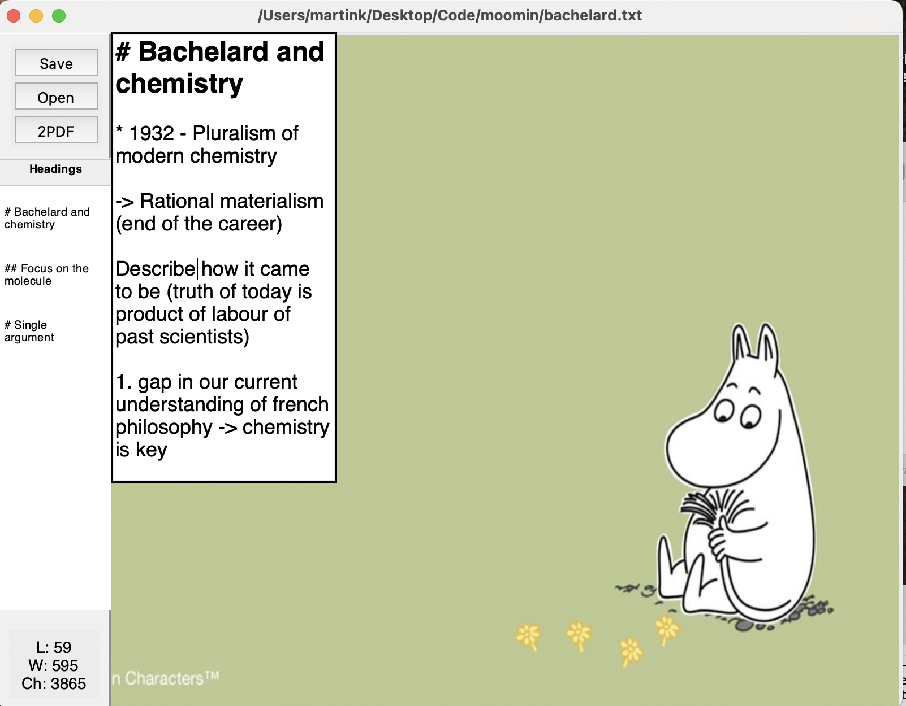

---title: Říjen 2025
description: Zápisek za měsíc 
Stackslug: rijen2025
date: 2025-11-02 00:00:00+0000
tags:
    - Journal Entry
weight: 1
---

Měsíc někdy uteče a ani nevíš jak.
---------------

Napsal jsem konečně update toho streamlit UI. Má teď 3 datové zdroje (plán je ještě přidat bezrealitky), a poctivě sbírá data. Mám tam možná chybu v kódu, kterou snad brzy opravím (jedna hodnota se mi nemění tak, jak bych chtěl, kvůli špatnému IF/ELSE). Blížíme se tomu, že by ta data mohla být využitelná, neboť v scrapování s-realit mám už 26 166 položek. Kdyby se někomu z vás hodily, dejte vědět, rád se o ně podělím 

---------------

Měsíc říjen by se měl přejmenovat na měsíc textových editorů. První je Mumínkovský editor, jednoduchá obrazovka z TK s textovým polem a na pozadí je ukradený obrázek mumínka.  Dal jsem si trochu práce s generováním pdf z md, přidal jsem tam TOC (obsah) a Footnotes (Poznámky pod čarou). Už teoreticky kód můžu dát ven, což udělám v následujících dnech.

---------------

Druhý textový editor co jsem udělal je MVP překladatelského editoru, který má dvě textová okna vedle sebe. Jediná silná fuknce je, že při držení ctr se scrolluje v obou oknech najednou. Přidám tam ještě:
* Tlačítko pro import textu
* Tlačítko pro uložení textu
* Tlačítko pro překlad skrz Deepl
* klavesovou zkratku pro přepínání mezi okny.
* možná podpora formátu Word. 

Zde jak to vypadá  Trochu doufám, že to otestuji na nějakých překladatelých (min pro mé překlady v ICT union se to bude hodit)

---------------

Udělal jsem scrapper pro petice.com. Ještě nefunguje na 100 %, ale funguje docela dobře - stáhl jsem si dva datasety: 1) seznam signatářů přejmenování ulice Ruská na Dany Drábové a 2) petice žádající ministerské křeslo pro Filipa Turka. Z komentářů k těmto peticím jde získat nějaké argumenty těchto stran v konfliktech. Přijde mi to jako docela dobrý datový zdroj, min pro nějakou politologickou práci by se to mohlo hodit. Dostupný na mém githubu jako python script.

---------------

Byl jsem na jednom koncertě Redzeda v Lucerně music baru. Jinak píšu diplomku, poslouchám 6&2 a jeho rap, Nikdy se nevyseru na bráchu a stýkám se s přáteli. 

---------------

> But preemptive surrender is no sign of wisdom. Any reality made by human beings can be
remade by them. The price of this power is mutual obligation: we can never let ourselves off
the hook. The things we can accomplish together are, by definition, within our sphere of
control, even if we have to act through structures that are bigger than any of us alone to
achieve them. As grating as it may be to admit, it turns out that some of those hoary positive-
thinking cliches the philosophers rail against are true, as long as we stick to the first-person
plural. We are responsible for how our lives unfold; we can do things that seem impossible.
But for those of us living in the heart of the American empire, with our duly elected
president marching our society gleefully into hell, this news is far from reassuring. What we
do with our lives does matter — as much as anything possibly could. That should keep us up
at night.
[ERIK BAKER](https://www.thedriftmag.com/how-i-learned-to-stop-worrying-and-love-my-shitty-life/)